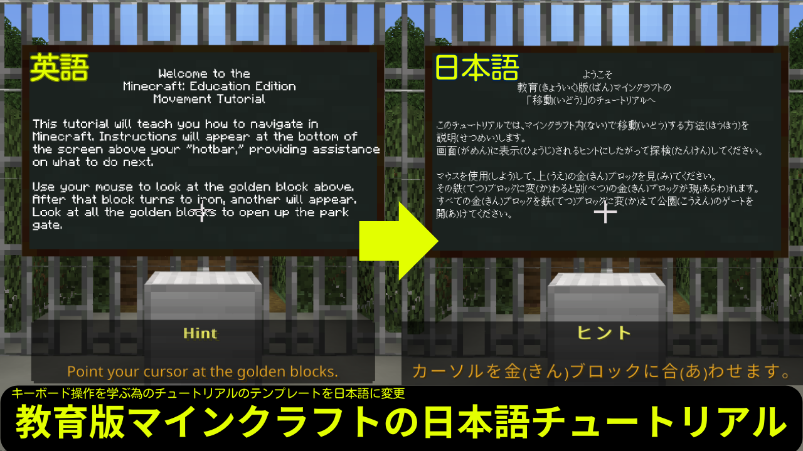
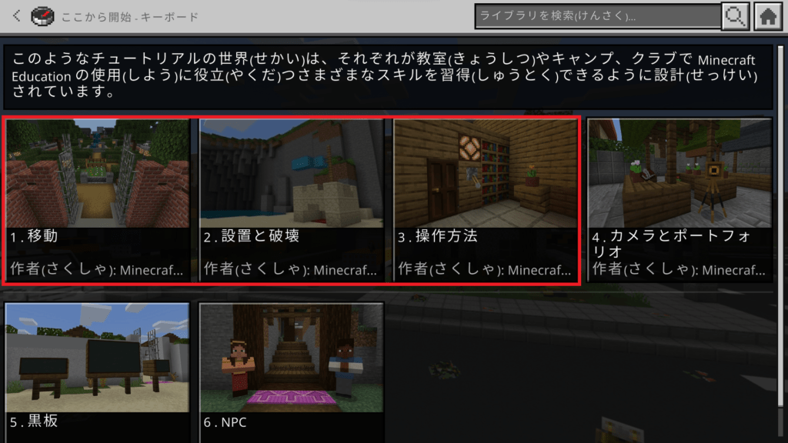
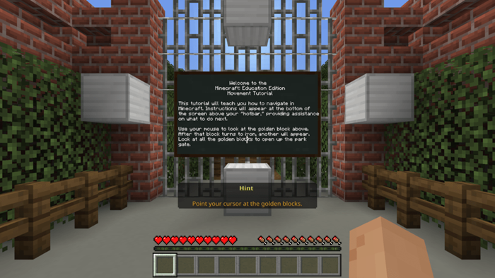
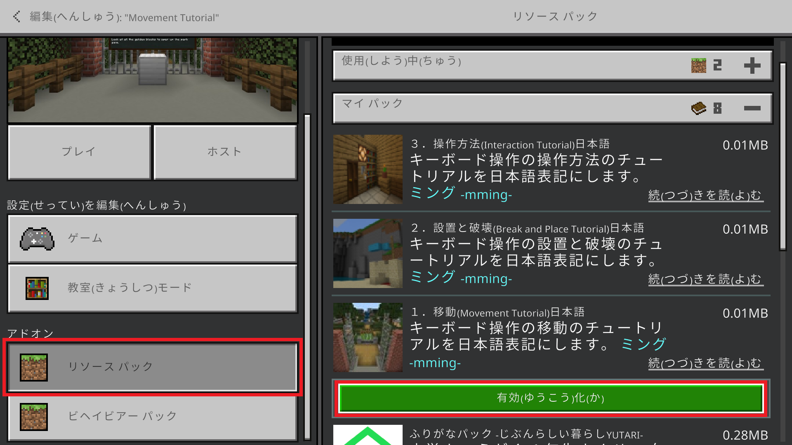
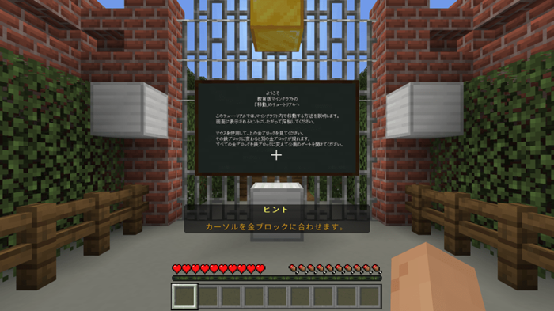

	<h2 class="section-heading text-uppercase">教育版マインクラフトのキーボード操作を学ぶ為のテンプレートを日本語表示</h2>

{: img-fluid d-block mx-auto}

教育版マインクラフトのキーボード操作が学べるチュートリアルは英語表示です。操作方法の基礎が学べるように日本語化リソースパックを公開します。

### 日本語化の出来るテンプレート

{: img-fluid d-block mx-auto }

上記画像の赤色線が囲む３つのテンプレートだけですが、日本語化が出来ます。
1. 移動(Movement Tutorial)
1. 設置と破壊(Break and Place Tutorial)
1. 操作方法(Interaction Tutorial)

### 日本語リソースパックを取得する

「キーボード操作チュートリアルの日本語リソースパック」は、**個人・学校・非営利団体の利用に限って**公開していします。
下記リンクより、利用規約の同意とアンケートの回答をいただき、対象のファイルをダウンロードしてください。

[📂キーボード操作チュートリアルの日本語リソースパックはこちらに配置しています📂](https://forms.office.com/r/iCQAJThf96)

mcpackファイルなので、教育版マインクラフトから開き、インポートしてください。

### ワールドを日本語化する
- テンプレートは「プレイ」⇒「ライブラリを表示」⇒「遊び方」⇒「ここから開始 – キーボード」にあります。  
テンプレートをダブルクリックして開始してください。
{: img-fluid d-block mx-auto}

- 最初は英語で表示されます。[ESC]⇒[レッスンを終了]を押下して一度終了してください。
{: img-fluid d-block mx-auto}

- 作成したワールドの設定からリソースパックを適用してください。
{: img-fluid d-block mx-auto}

- リソースパック適用後にはこのように日本語表示になります。
{: img-fluid d-block mx-auto}

